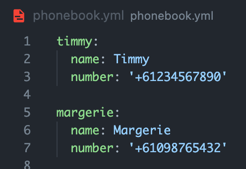

# Kim Kartweetian

## Receive text messages with the latest Kim Kardashian Tweets!

### Purpose
None really, I just wanted to experiment with the Twitter and Twilio API

### Use cases
Replace Kim's Twitter handle with any other to receive notifications of your favourite Tweeter... Twitter? Twitter person?

### How to run
You will first need to be set up with a Twitter Developer account.  
You'll also need a Twilio account.  

Clone the repository, cd in, then run `bundle install` to install the dependencies.  

Save your API Key / Twilio phone number etc into a .env file.  

Create a new file `phonebook.yml`
This is where you will save the details of the people you're sending a text message to.  

It's important to wrap the phone number in quote marks otherwise it will be read as an integer rather than a string. You could also make this conversion in Ruby, whatever works for you I guess.

One you've got some contacts in there you should be good to go.  
Either hardcode the Twitter username into the `retrieve_user_id` method call or leave it blank to enter one in the terminal when it is called.

### Future development
- I'd like to clean up the src code so everything is in it's own proper directory
- I'd also like to eventually send the text message as soon as the person tweets. I think that's a 'premium' feature of the Twitter API though